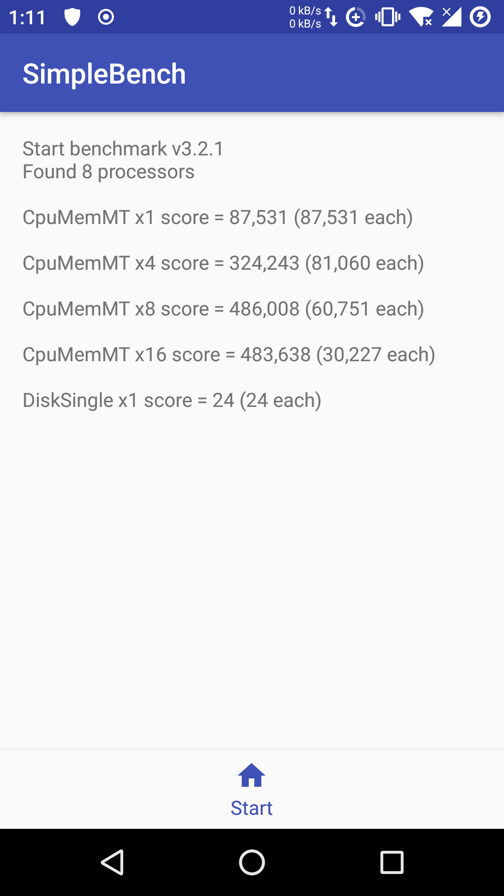
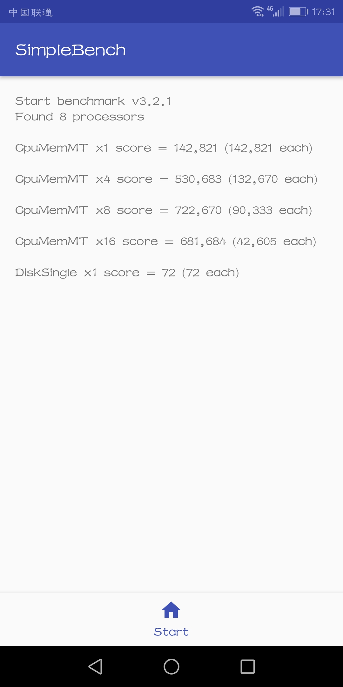

# simplebench
neoe simple benchmark program on CPU,memory and disk. Quick and meaningful results.

## how it works
The results seems more real than cpubenchmark.net and cpuboss.com

neoe simple benchmark use java in all platform.
test single, 4/8/16 threads performance.
benchmark depends on CPU speed and memory r/w speed.

## versions
I wanted to keep benchmark value same across versions:
but ver3.2 score on same set is about 10% better than ver3.1


## usage
run in commmand line(need recent JRE or JDK):
```
> git clone https://github.com/neoedmund/simplebench
> cd simplebench
> java -jar dist/simplebench.jar
```

android apk download:  AndrApplication/app/build/outputs/apk/debug/app-debug.apk

## some results

### Xeon E5 2670 (8 core 16 cpu)　SSD
```
Start benchmark v3.2.1
Found 16 processors
CpuMemMT x1 score = 145,185 (145,185 each)
CpuMemMT x4 score = 622,005 (155,501 each)
CpuMemMT x8 score = 1,229,813 (153,726 each)
CpuMemMT x16 score = 1,828,194 (114,262 each)
DiskSingle x1 score = 167 (167 each)

Start benchmark v3.1
CpuMemSingle in 6,000 ms(431 turns), score = 215,500
CpuMemMT01 in 4,016 ms(230 turns), score = 171,812
...
CpuMemMT4 x4 in 4,047 ms, score = 667,160
CpuMemMT03 in 4,001 ms(199 turns), score = 149,212
...
CpuMemMT8 x8 in 4,032 ms, score = 1,168,154
CpuMemMT05 in 4,016 ms(163 turns), score = 121,762
...
CpuMemMT16 x16 in 4,047 ms, score = 1,905,856
DiskSingle in 5,907 ms(2 turns), score = 101
```


### OrangePi PC (H3)  (FIXME:old data)　
```
> benchmark:CpuMem finished in 12254, turn = 4 score = 979.2720744246776
> benchmark:CpuMem finished in 12279, turn = 4 score = 977.2782799902272
> benchmark:CpuMem finished in 12310, turn = 4 score = 974.817221770918
> benchmark:CpuMem finished in 12325, turn = 4 score = 973.630831643002
> multiThreadBench x4 finished in 12337, score = 976.2496019572062
> Start benchmark:Disk
> disk refvalue=70176
> benchmark:Disk finished in 13301, turn = 1 score = 22.554695135704083
```

### banabapi (armv7 sun7i A20)  
```
> multiThreadBench x4 finished in 16419, score = 367.20373048067046

Start benchmark v3.2.1
Found 2 processors
CpuMemMT x1 score = 2,192 (2,192 each)
CpuMemMT x4 score = 4,611 (1,152 each)
CpuMemMT x8 score = 4,627 (578 each)
CpuMemMT x16 score = 4,422 (276 each)
DiskSingle x1 score = 25 (25 each)
```

### AMD FX8320 8 cores
```
Start benchmark v3.1
CpuMemSingle in 6,005 ms(274 turns), score = 136,885
CpuMemMT03 in 4,006 ms(177 turns), score = 132,551
...
CpuMemMT4 x4 in 4,014 ms, score = 523,916
CpuMemMT02 in 4,009 ms(147 turns), score = 110,002
...
CpuMemMT8 x8 in 4,040 ms, score = 879,207
CpuMemMT08 in 4,001 ms(84 turns), score = 62,984
...
CpuMemMT16 x16 in 4,151 ms, score = 930,137
DiskSingle in 5,009 ms(1 turns), score = 59 (windows disk is much slower than linux score=229)
```

### AMD A6-3650 APU
```
Start benchmark v2.2
CpuMemSingle in 6,013 ms(278 turns), score = 138,699 
CpuMemMT00 in 6,011 ms(74 turns), score = 36,932 
...
CpuMemMT x16 in 6,164 ms, score = 598,637 
DiskSingle in 7,216 ms(5 turns), score = 207 
```

### Amazon Linux AMI (Xeon E5-2670 v2 @ 2.50GHz (1 cpu core))
```
Start benchmark v2.2
CpuMemSingle in 6,011 ms(436 turns), score = 217,601
CpuMemMT04 in 6,075 ms(21 turns), score = 10,370
CpuMemMT03 in 6,096 ms(11 turns), score = 5,413
CpuMemMT02 in 6,118 ms(11 turns), score = 5,393
CpuMemMT01 in 6,138 ms(11 turns), score = 5,376
CpuMemMT06 in 6,023 ms(22 turns), score = 10,957
CpuMemMT07 in 6,067 ms(22 turns), score = 10,878
CpuMemMT08 in 6,110 ms(22 turns), score = 10,801
CpuMemMT09 in 6,151 ms(22 turns), score = 10,729
CpuMemMT10 in 6,195 ms(22 turns), score = 10,653
CpuMemMT11 in 6,238 ms(22 turns), score = 10,580
CpuMemMT13 in 6,305 ms(22 turns), score = 10,467
CpuMemMT14 in 6,326 ms(18 turns), score = 8,536
CpuMemMT00 in 6,355 ms(12 turns), score = 5,664
CpuMemMT12 in 6,347 ms(16 turns), score = 7,562
CpuMemMT15 in 6,372 ms(11 turns), score = 5,178
CpuMemMT05 in 6,216 ms(23 turns), score = 11,100
CpuMemMT x16 in 6,400 ms, score = 135,000
DiskSingle in 6,461 ms(6 turns), score = 278
```
### Xeon L5408 4 core 4 thread, SSD, windows 10
```
Start benchmark v3.2.1
Found 4 processors
CpuMemMT x1 score = 100,521 (100,521 each)
CpuMemMT x4 score = 335,320 (83,830 each)
CpuMemMT x8 score = 359,625 (44,953 each)
CpuMemMT x16 score = 355,227 (22,201 each)
DiskSingle x1 score = 94 (94 each)
```
### AMD Opteron 4386 (tested on VM with 1 core)
```
Start benchmark v3.1
CpuMemSingle in 6,008 ms(223 turns), score = 111,351
```

### i7-4820K 3.70GHz  SSD
```
Start benchmark v3.2.1
Found 8 processors
CpuMemMT x1 score = 213,432 (213,432 each)
CpuMemMT x4 score = 783,870 (195,967 each)
CpuMemMT x8 score = 1,267,479 (158,434 each)
CpuMemMT x16 score = 1,332,188 (83,261 each)
DiskSingle x1 score = 244 (244 each)
```


### G1840T  B85 
```
Start benchmark v3.2.1
Found 2 processors
CpuMemMT x1 score = 147,845 (147,845 each)
CpuMemMT x4 score = 235,308 (58,827 each)
CpuMemMT x8 score = 255,579 (31,947 each)
CpuMemMT x16 score = 268,678 (16,792 each)
DiskSingle x1 score = 535 (535 each)
```

### Intel Core i3 6100 @ 3.70GHz
```
Start benchmark v3.2.1
Found 4 processors
CpuMemMT x1 score = 240,477 (240,477 each)
CpuMemMT x4 score = 758,902 (189,725 each)
CpuMemMT x8 score = 794,247 (99,280 each)
CpuMemMT x16 score = 708,833 (44,302 each)
DiskSingle x1 score = 385 (385 each)
```
### Intel(R) Xeon(R) Platinum 8163 CPU @ 2.50GHz
```
Start benchmark v3.2.1
Found 4 processors
CpuMemMT x1 score = 163,832 (163,832 each)
CpuMemMT x4 score = 642,488 (160,622 each)
CpuMemMT x8 score = 640,301 (80,037 each)
CpuMemMT x16 score = 629,410 (39,338 each)
DiskSingle x1 score = 518 (518 each)
```

### Intel(R) Xeon(R) CPU E5-2630 v4 @ 2.20GHz
```
Start benchmark v3.2.1
Found 2 processors
CpuMemMT x1 score = 174,553 (174,553 each)
CpuMemMT x4 score = 305,411 (76,352 each)
CpuMemMT x8 score = 285,890 (35,736 each)
CpuMemMT x16 score = 307,932 (19,245 each)
DiskSingle x1 score = 470 (470 each)
```

### AMD Ryzen 7 PRO 2700U  
```
(Windows 10)
benchmark v3.2.1
Found 8 processors
CpuMemMT x1 score = 127,962 (127,962 each)
CpuMemMT x4 score = 274,632 (68,658 each)
CpuMemMT x8 score = 529,627 (66,203 each)
CpuMemMT x16 score = 995,889 (62,243 each)
DiskSingle x1 score = 141 (141 each)

(linux ubuntu)
benchmark v3.2.1
Found 8 processors
CpuMemMT x1 score = 234,456 (234,456 each)
CpuMemMT x4 score = 613,890 (153,472 each)
CpuMemMT x8 score = 793,010 (99,126 each)
CpuMemMT x16 score = 797,023 (49,813 each)
DiskSingle x1 score = 546 (546 each)
```


### AMD EPYC 7501 32-Core Processor
```
Start benchmark v3.2.1
Found 1 processors

CpuMemMT x1 score = 180,209 (180,209 each)
CpuMemMT x4 score = 161,058 (40,264 each)
CpuMemMT x8 score = 160,038 (20,004 each)
CpuMemMT x16 score = 160,476 (10,029 each)
DiskSingle x1 score = 441 (441 each)
```


### Phone kiwi Qualcomm MSM8939v2 Snapdragon 616


### Phone honor9lite kirin 659



### please add more here
contribute.

